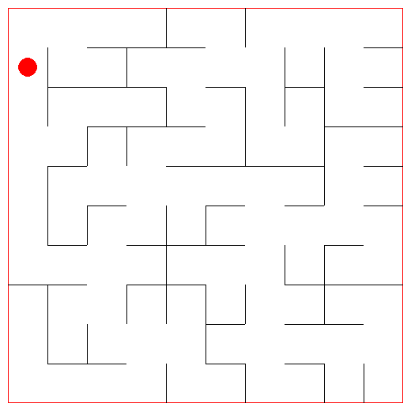
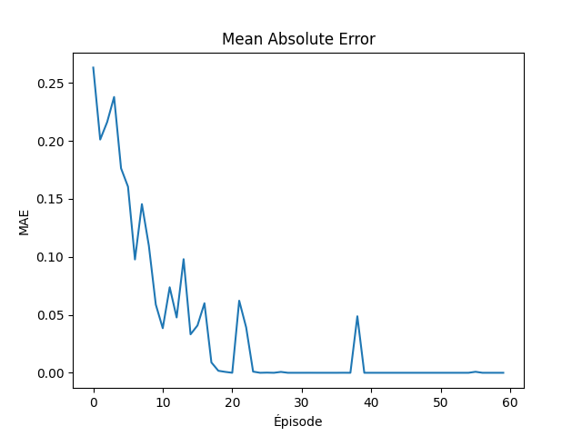

# rl-qlearning-maze

A reinforcement learning project.<br/>

A maze, generated, being explored by an Agent.<br/>
The agent use the Q-Learning algorithm.<br/>

Result :



Train Mean Absolute Error :



## installation

```bash
# venv creation
python -m venv .venv

# venv activation
.venv\Scripts\activate.bat # if windows

# install dependencies
pip install -r requirements.txt
```

## Lancement

```
python src\main.py
```